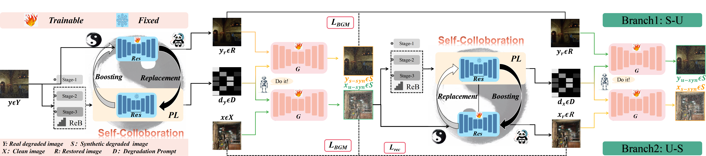

# 【TPAMI'2025🔥】 Re-boosting Self-Collaboration Parallel Prompt GAN for Unsupervised Image Restoration

### Xin Lin, Yuyan Zhou, Jingtong Yue, Chao Ren, Kelvin C.K. Chan, Lu Qi, Ming-Hsuan Yang

This is the journal version of [SCPGabNet](https://openaccess.thecvf.com/content/ICCV2023/papers/Lin_Unsupervised_Image_Denoising_in_Real-World_Scenarios_via_Self-Collaboration_Parallel_Generative_ICCV_2023_paper.pdf)

This is the official code of [RSCP^2^GAN](https://arxiv.org/pdf/2408.09241) for denoising tasks.

The code of deraining and desnowing will be released recent days.

## Abstract
Deep learning methods have shown remarkable performance in image restoration, particularly when trained on large-scale paired datasets. However, acquiring such data in real-world scenarios poses a significant challenge. Although unsupervised restoration approaches based on generative adversarial networks (GANs) offer a promising solution without paired datasets, they are difficult to surpass the performance limitations of conventional unsupervised GAN-based frameworks without significantly modifying existing structures or increasing the computational complexity of the restorer. To address this problem, we propose a self-collaboration (SC) strategy for existing restoration models. It utilizes the information from the previous stage as feedback to guide the subsequent stages and achieves significant performance improvement without increasing the framework's inference complexity. It comprises a prompt learning (PL) module and a restorer ($Res$). It iteratively replaces the previous less powerful fixed restorer $\overline{Res}$ in the PL module with the current powerful $Res$. The enhanced PL module will generate better pseudo-degraded/clean image pairs, leading to a more powerful $Res$ for the next iteration without any extra parameters or inference computational complexity. The proposed iteratively updated process generates better synthetic clean/degraded image pairs, leading to a more powerful $Res$ for the next iteration. Additionally, the traditional self-ensemble (SE) and our self-collaboration (SC) strategies can enhance the performance of the pre-trained restorers from different perspectives. However, the SE increases the computational complexity during the inference phase. Therefore, we propose a re-boosting module to the SC (Reb-SC) to improve the SC strategy further by incorporating SE into SC without increasing the inference time. In this way, the performance of the restorer can be improved further (approximately 0.3dB). In addition, we propose a baseline framework that includes parallel generative adversarial branches with complementary "self-synthesis" and "unpaired-synthesis" constraints. This baseline ensures the effectiveness of the training framework. Extensive experimental results on various restoration tasks demonstrate that the proposed method performs favorably against existing state-of-the-art unsupervised restoration methods.

## Requirements
Our experiments are done with:

- Python 3.7.13
- PyTorch 1.13.0
- numpy 1.21.5
- opencv 4.6.0
- scikit-image 0.19.3

## Dataset

SIDD

Train: https://pan.baidu.com/s/1c1iPIIJvSfq6s6_M7iyjPA  2oe5 

Test: https://pan.baidu.com/s/1yltsD684qpJa0SMJ9SdR5w   8qzf 

PolyU

https://pan.baidu.com/s/1TUTYkjX230UzCy_VhHEvQA   ek2d 

## Pre-trained Models

SIDD/DND:  https://pan.baidu.com/s/1XyovAFFLjOBYgsnLgkrecw    uv0m 

PolyU:  https://pan.baidu.com/s/16yilFMMDJUSM9bEa5719tw       j61y 

## Train & Test
You can get the complete SIDD validation dataset from https://www.eecs.yorku.ca/~kamel/sidd/benchmark.php.

'.mat' files need to be converted to images ('.png'). 

train and test are both in `train_v6.py`.

run `trainv6.py`.

## Citation

## Contact
If you have any questions, please contact linxin020826@gmail.com
